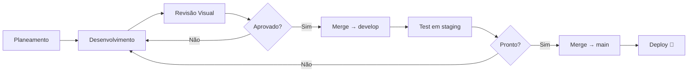

# ⚙️ WORKFLOW — O Mundo Pula Development

> Processo de trabalho, convenções e boas práticas para o desenvolvimento do site.

---

## 🔀 Git Workflow

### Estratégia de Branching

```
main
  └── develop
        ├── feature/fase-0-setup
        ├── feature/fase-1-html
        ├── feature/fase-2-css
        ├── feature/fase-3-javascript
        ├── feature/fase-4-integrations
        ├── feature/fase-5-responsive
        └── feature/fase-6-deploy
```

### Regras

| Branch | Função | Merge para |
|--------|--------|-----------|
| `main` | Produção estável | — |
| `develop` | Integração de features | `main` |
| `feature/*` | Desenvolvimento de funcionalidades | `develop` |
| `fix/*` | Correções de bugs | `develop` |
| `hotfix/*` | Correções urgentes em produção | `main` + `develop` |

### Convenção de Commits

Utilizamos [Conventional Commits](https://www.conventionalcommits.org/):

```
<tipo>(<escopo>): <descrição curta>

[corpo opcional]

[rodapé opcional]
```

#### Tipos

| Tipo | Descrição |
|------|-----------|
| `feat` | Nova funcionalidade |
| `fix` | Correção de bug |
| `style` | Alterações de CSS/estilo (sem lógica) |
| `refactor` | Refatoração de código |
| `docs` | Documentação |
| `chore` | Tarefas de manutenção (configs, deps) |
| `perf` | Melhorias de performance |
| `test` | Testes |

#### Exemplos

```bash
feat(hero): add carousel slider with auto-play
style(nav): implement sticky header transition
fix(reviews): handle Google API rate limit error
docs(readme): update installation instructions
chore(deps): upgrade vite to 5.x
```

---

## 📁 Convenções de Código

### HTML

- Indentação: **2 espaços**
- Usar HTML5 semântico (`<header>`, `<nav>`, `<main>`, `<section>`, `<article>`, `<footer>`)
- IDs únicos e descritivos para cada secção (ex: `id="sobre-nos"`, `id="ofertas"`)
- Atributos em minúsculas
- Sempre incluir `alt` em ``
- Ordem de atributos: `id`, `class`, `data-*`, `src/href`, `alt/title`

```html
<!-- ✅ Correto -->
<section id="sobre-nos" class="section section--about" data-animate="fade-up">
  <h2 class="section__title">Sobre Nós</h2>
</section>

<!-- ❌ Errado -->
<div id="about">
  <h2>Sobre Nós</h2>
</div>
```

### CSS

- Metodologia: **BEM (Block Element Modifier)**
- Ficheiros separados por responsabilidade
- Usar CSS Custom Properties (variáveis) para todos os tokens
- Mobile-first media queries (`min-width`)
- Evitar `!important`
- Comentários de secção com separadores visuais

```css
/* ==========================================================================
   HERO BANNER
   ========================================================================== */

.hero {
  position: relative;
  min-height: 100vh;
  overflow: hidden;
}

.hero__content {
  position: relative;
  z-index: 2;
  padding: var(--space-xl);
}

.hero__title {
  font-family: var(--font-heading);
  font-size: clamp(2rem, 5vw, 4rem);
  font-weight: 700;
  color: var(--color-white);
  line-height: 1.2;
}

.hero__title--highlight {
  color: var(--color-primary);
}

/* Responsive */
@media (min-width: 768px) {
  .hero__content {
    max-width: 60%;
  }
}
```

### JavaScript

- Módulos ES6+ (`import`/`export`)
- `const` por defeito, `let` quando necessário
- Nomes descritivos em camelCase
- Classes em PascalCase
- Event delegation quando possível
- Usar `IntersectionObserver` em vez de scroll listeners
- Comentários JSDoc para funções públicas

```javascript
/**
 * Inicializa o observador de scroll para animações.
 * @param {string} selector - Seletor CSS dos elementos a animar
 * @param {Object} options - Opções do IntersectionObserver
 */
export function initScrollAnimations(selector = '[data-animate]', options = {}) {
  const elements = document.querySelectorAll(selector);
  
  const observer = new IntersectionObserver((entries) => {
    entries.forEach((entry) => {
      if (entry.isIntersecting) {
        entry.target.classList.add('is-visible');
        observer.unobserve(entry.target);
      }
    });
  }, {
    threshold: 0.1,
    ...options,
  });

  elements.forEach((el) => observer.observe(el));
}
```

---

## 🎨 Design Guidelines

### Princípios Visuais (Inspirados no Kidearn)

1. **Formas orgânicas** — Bordas arredondadas, blobs SVG, ondas
2. **Cores vivas mas harmoniosas** — Verde-teal primário com tons quentes de accent
3. **Tipografia contrastante** — Headers bold e impactantes, body text legível
4. **Whitespace generoso** — Dar espaço para respirar entre secções
5. **Micro-animações** — Hover suaves, transições de entrada
6. **Elementos lúdicos** — Adequados ao contexto infantil (shapes, ícones divertidos)
7. **Fotografias reais** — Usar fotos genuínas das crianças e do espaço

### Spacing System

```css
:root {
  --space-xs: 0.25rem;   /* 4px */
  --space-sm: 0.5rem;    /* 8px */
  --space-md: 1rem;      /* 16px */
  --space-lg: 1.5rem;    /* 24px */
  --space-xl: 2rem;      /* 32px */
  --space-2xl: 3rem;     /* 48px */
  --space-3xl: 4rem;     /* 64px */
  --space-4xl: 6rem;     /* 96px */
  --space-5xl: 8rem;     /* 128px */
}
```

### Breakpoints

```css
/* Mobile First */
/* Base: 0–479px (mobile) */
@media (min-width: 480px)  { /* Mobile large */ }
@media (min-width: 768px)  { /* Tablet */ }
@media (min-width: 1024px) { /* Desktop small */ }
@media (min-width: 1200px) { /* Desktop */ }
@media (min-width: 1440px) { /* Widescreen */ }
```

---

## 🧪 Quality Checklist

Antes de cada merge para `develop`:

### Funcional
- [ ] Todas as secções visíveis e com conteúdo correto
- [ ] Navegação funcional (smooth scroll para todas as secções)
- [ ] Links externos a funcionar
- [ ] Formulários a validar e enviar
- [ ] Sem erros na consola do browser

### Visual
- [ ] Layout correto em mobile (375px)
- [ ] Layout correto em tablet (768px)
- [ ] Layout correto em desktop (1440px)
- [ ] Animações suaves (sem jank)
- [ ] Imagens a carregar corretamente
- [ ] Fontes carregadas

### Performance
- [ ] Lighthouse Performance > 90
- [ ] Lighthouse Accessibility > 90
- [ ] Lighthouse Best Practices > 90
- [ ] Lighthouse SEO > 90
- [ ] No layout shifts (CLS < 0.1)

### Código
- [ ] HTML válido (W3C Validator)
- [ ] CSS sem erros
- [ ] JS sem warnings
- [ ] Sem `console.log()` esquecidos
- [ ] Commits seguem convenção

---

## 🔧 Ferramentas de Desenvolvimento

| Ferramenta | Uso |
|---|---|
| **VS Code** | Editor principal |
| **Vite** | Dev server + build |
| **Chrome DevTools** | Debug e performance |
| **Lighthouse** | Auditorias |
| **W3C Validator** | Validação HTML |
| **Can I Use** | Compatibilidade de CSS/JS |
| **Squoosh** | Otimização de imagens |
| **Google PageSpeed Insights** | Performance em produção |

---

## 📋 Ciclo de Desenvolvimento



### Passos por Feature

1. **Criar branch** — `git checkout -b feature/nome-da-feature`
2. **Desenvolver** — Implementar a funcionalidade
3. **Testar localmente** — `npm run dev`
4. **Commit** — Seguir convenção de commits
5. **Push** — `git push origin feature/nome-da-feature`
6. **Pull Request** — Criar PR para `develop`
7. **Revisão** — Verificar checklist de qualidade
8. **Merge** — Merge para `develop`
9. **Verificar em staging** — Testar integração
10. **Release** — Merge `develop` → `main`

---

## 🌐 Ambientes

| Ambiente | URL | Branch |
|----------|-----|--------|
| **Desenvolvimento** | `localhost:5173` | `feature/*` |
| **Staging** | TBD (Netlify preview) | `develop` |
| **Produção** | `omundopula.pt` | `main` |

---

## 📝 Notas Importantes

### Conteúdo em Português
- Todo o conteúdo do site é em **português (pt-PT)**
- Comentários de código podem ser em inglês
- Documentação (esta pasta) é em português

### Assets do Site Atual
- O site atual está em WordPress com tema Zakra + Elementor
- Todas as imagens devem ser descarregadas e otimizadas
- Os PDFs informativos devem ser mantidos na pasta `public/docs/`
- Google Reviews e Instagram Feed requerem chaves de API

### RGPD
- Implementar banner de cookies
- Política de privacidade
- Consentimento para formulários
